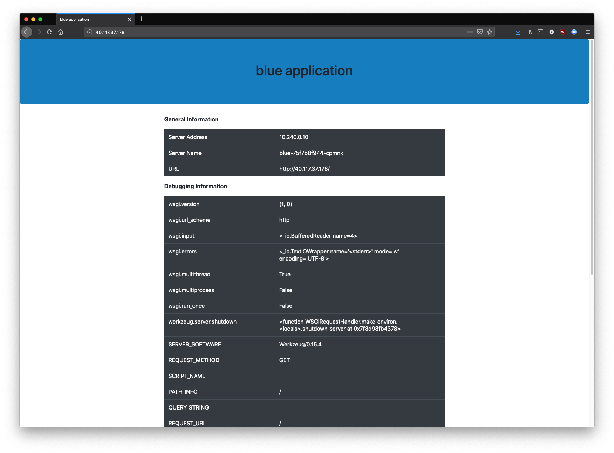

# Kubernetes Blue/Green Dockerfile

[]

Find it on [Docker Hub](https://hub.docker.com/r/alexfeig/bluegreen).

This is a dead simple blue/green application tester built with Flask.

It's meant to be used by Kubernetes, and uses the `app_color` environment variable to set the application color.

Please see `k8s/` for examples.

## Screenshot

